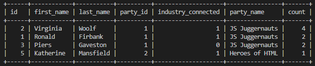

  # U Develop It Voting System
  This application uses MySQL, Node.js, and Express.js to handle the voting data for U Develop It. Users are able to make GET, POST, PUT, and DELETE requests to modify or return voting data for different candidates, parties, voters, and votes.
  
  ## Table of Contents
  * [Installation](#installation)
  * [Built With](#built)
  * [Usage Information](#usage)
  * [Authors & Acknowledgements](#credits)
  * [Tests](#tests)
  * [Contact](#questions)
  
  ## Installation 
  After cloning this repository, please populate the sample .env file with the appropriate MySQL credentials and change the file name to just ".env". Enter "npm i" in the terminal to download all dependencies for this application, and then use "npm start" to run the application.
  
  ## Built Using 
  * Node.js
  * Express.js
  * MySQL
  * JavaScript
  * Insomnia
  * npm dotenv

  ## Usage Information
  This application is used for the U Develop It voting application. 
    

  ## Authors & Acknowledgements
  
  Base code © 2020 - 2022 Trilogy Education Services, a 2U, Inc. brand. All Rights Reserved. 
  Made by [TOVTC](https://github.com/TOVTC).
  
  ## Tests
    All input values are tested upon submission.
  
  ## Questions?
  Contact repository author via [GitHub](https://github.com/TOVTC). 
    
  
  